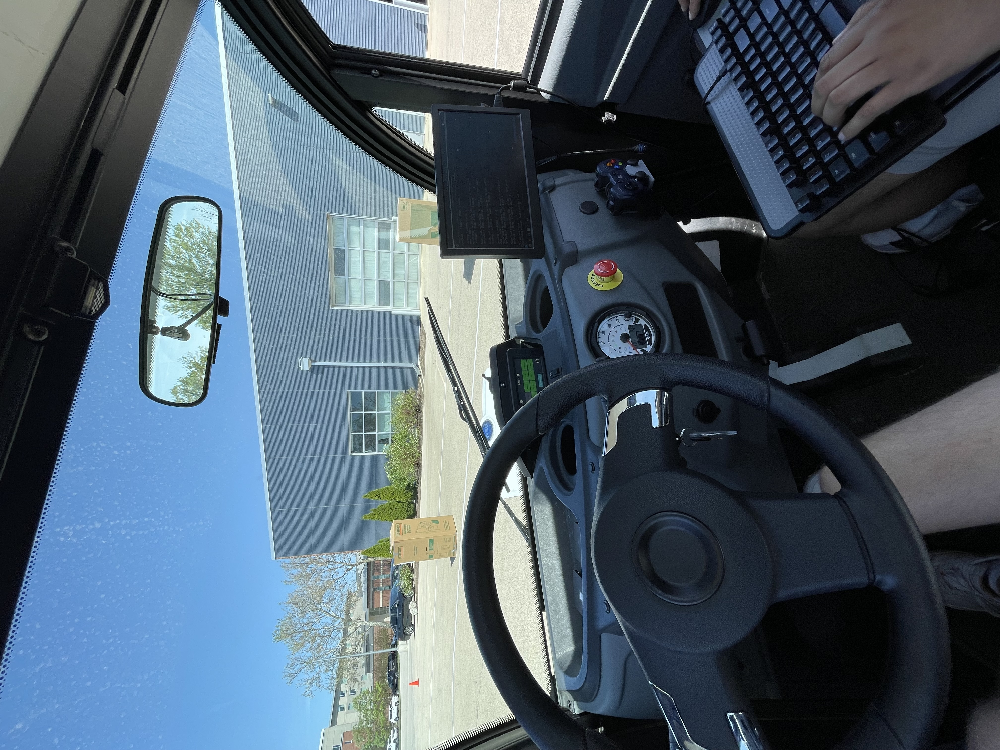

# Autonomous Vehicle Project

Car autonomously identifies and navigates around two boxes in a figure 8 pattern. 
Also include YOLO-based human pose gesture detection. 
Using PID Control, GPS Waypoint Detection, and Object Detection.

*This repo excludes all necessary package, config, gem, xml, etc. files needed to actually run.*

<!--  -->
